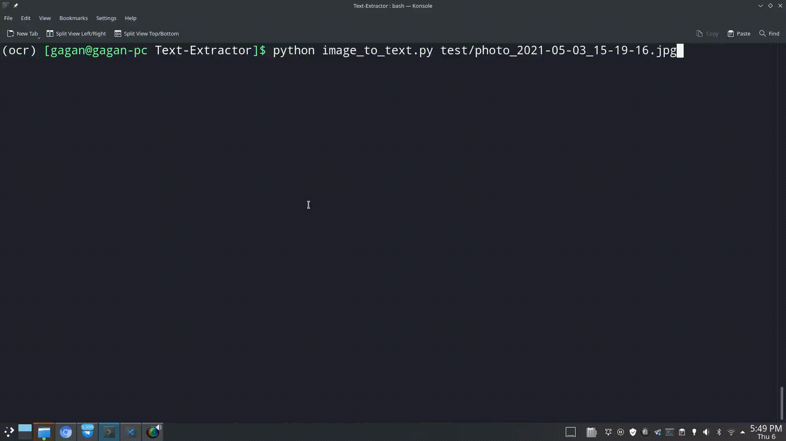

# COVID-Text-Extractor

Extract COVID related info from Images, PDFs and Texts using Google's Tesseract-OCR, PDFMiner.six and Regular Expressions.

## **How it can be used?**

- For **building APIs**
- For **creating bots** (Telegram, Twitter...)
- For **Automatting COVID Data extraction**, and more!

# **USAGE:**

```bash
python3 image_to_text.py <path_to_image_file>
```



### For Extracting Text on a random image from test directory:

```bash
python3 image_to_text.py
```

## **Requirements:**

- Python 3.9.4
- OpenCV (Contrib) [4.5.1.48]
- PyTesseract [0.3.7]
- Pillow [8.2.0]
- Numpy [1.20.2]

### **Installing requirements...**

```bash
pip3 install -r requirements.txt
```

## **IMPORTANT Dependency:**

Install **Tesseract Training Data (english)** according to your OS

### For Arch Linux Users (mine is Manjaro):

```bash
pacman -S tesseract-data-eng
```

### For Other Users:

[**Click here**](https://github.com/tesseract-ocr/tessdata/blob/master/eng.traineddata) to Download **eng.traineddata** and configure the [Python script](image_to_text.py) accordingly.

## What it Currently Extracts in Texts and Images:

- **Oxygen** (if Oxygen, Cylinder, Cans, Concentrator or Refill is in text)
- **Verified** (if source is verified)
- **Plasma** (if keyword is used in text)
- **Email** (all emails)
- **Age** (extracts age)
- **Blood-Groups** (All blood groups)
- **Phone-Numbers** (All phone numbers)
- **Required** (If Required keyword is used in text)
- **Help** (If Required keyword is used in text)
- **Food** (breakfast, lunch, dinner)
- **Urgent** (If urgent or required keyword is used in text)
- **ICU-Beds** (if ICU or Bed keyword is used in text)
- **Ventilator** (if Ventilator keyword is used in text)
- **Ambulance** (if Ambulance keyword is used in text)
- **Without** (if without keyword is used in text)
- **Free** (if Free keyword is used in text)
- **Report** (if Report keyword is used in text)
- **Fabiflu** (if Fabi-flu or Fabiflu is in text)
- **Medicine** (if Medicine in text)
- **Vaccine** (if vaccine or vaccination is in text)
- **Remdesivir** (if Remdesivir is in text)
- **Platelets** (if Platelet or Platelets is in text)